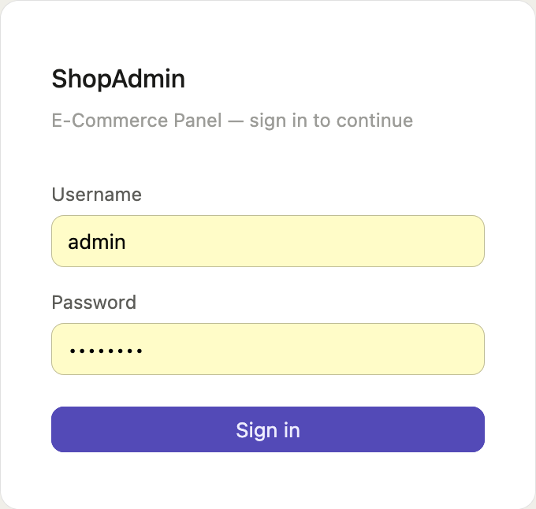
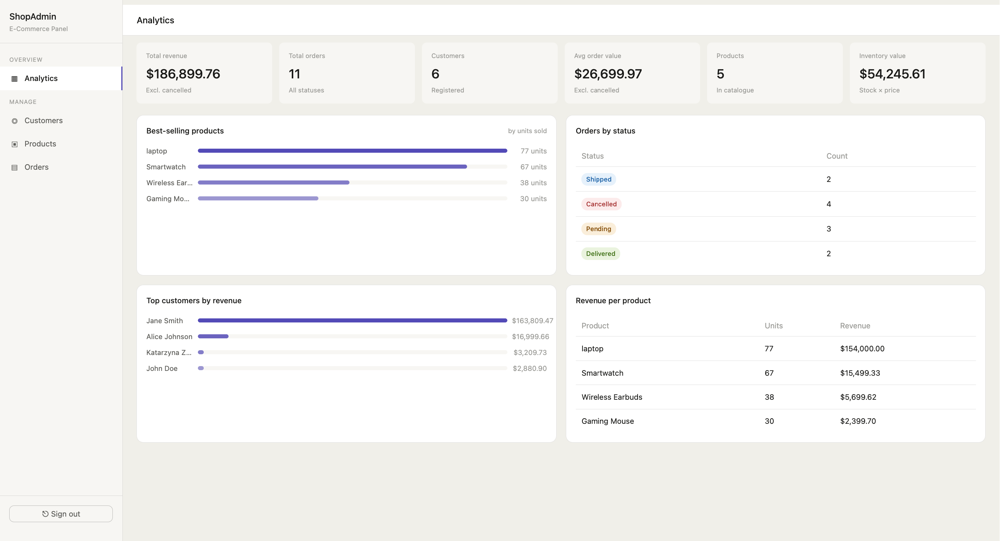
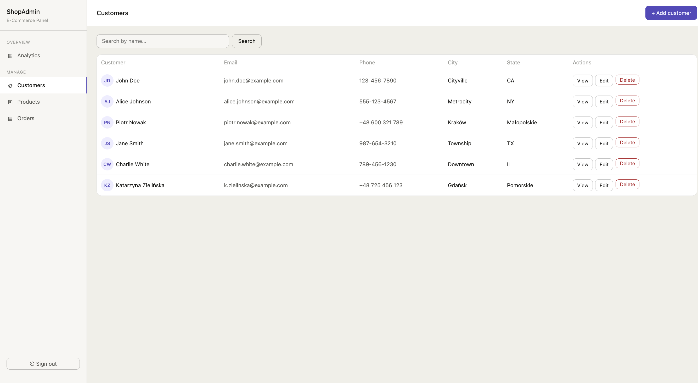
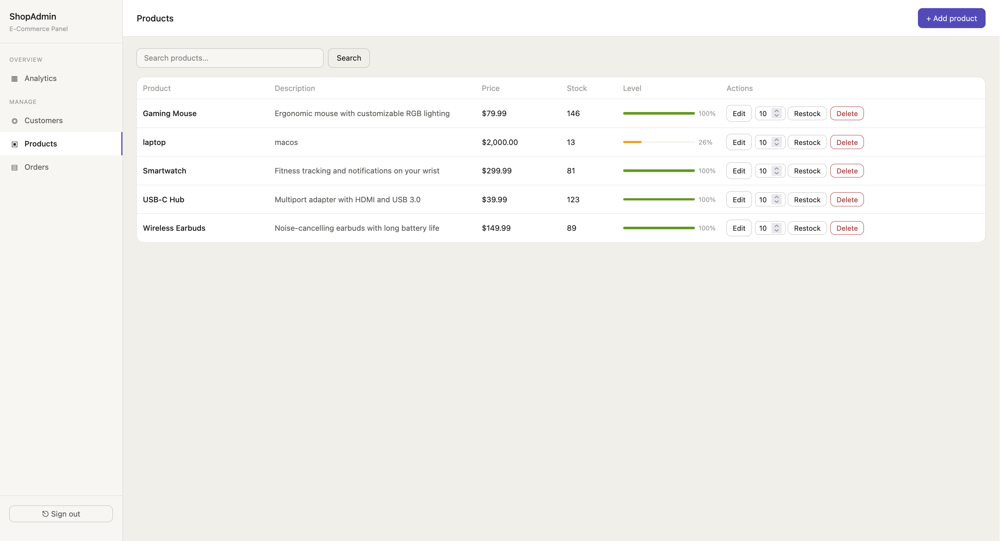
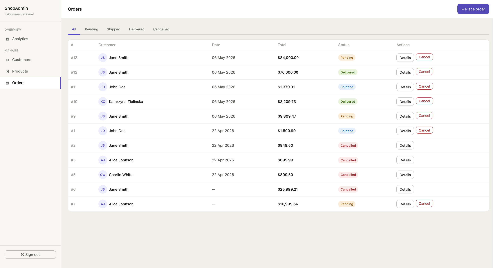

# ShopAdmin — E-Commerce Admin Panel

Java · Spring Boot · Hibernate · MySQL · Thymeleaf

## Overview

ShopAdmin is a full-stack web-based administration panel for managing an e-commerce store.

# Preview

## Login Page



## Analytics Dashboard



## Customers Management



## Products Management



## Orders Management



---

# Features

- Customer management
- Product inventory management
- Order processing
- Analytics dashboard
- Spring Security authentication
- BCrypt password encryption

---

# Tech Stack

- Java 17
- Spring Boot
- Spring Security
- Hibernate / JPA
- MySQL
- Thymeleaf
- Maven

---

# Installation

```bash
git clone https://github.com/your-username/shopadmin.git
cd shopadmin
mvn spring-boot:run
```

Open:

```text
http://localhost:8080
```

Default credentials:

```text
admin / admin123
```

---

# Documentation

- [dokumentacja.pdf](dokumentacja.pdf)

---

# Author

Maksym Pavlovsky
